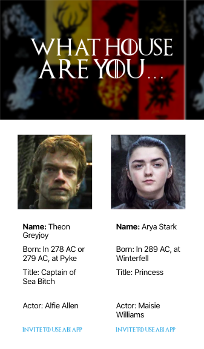

# abi-westeros

abi-westeros is a SPA that lets an ABI client invite their users to use the ABI application.

In this respository you will find both the front-end and the back-end. Although there is no database used, a server is needed in order to solve one an issue of CORS when using one of the external APIs.

<p align="center">
    
</p>


## Getting Started

1. Clone the repository:
```
git clone https://github.com/elliefairholm/abi-westeros
```
2. Move into the server folder and install the dependencies:
```
cd server && npm install
```
3. Run the server:
```
node index.js
```
2. Move into the client folder and install the dependencies:
```
cd ../client && npm install
```
3. Run the client:
```
npm run start
```

## Tech Stack

- [React.js](https://reactjs.org/)
- [Node.js](https://nodejs.org/en/)
- [Express.js](https://koajs.com/)

## Contributing

If you have any questions just drop me an email at <elliefairholm@gmail.com>.

Enjoy :)
